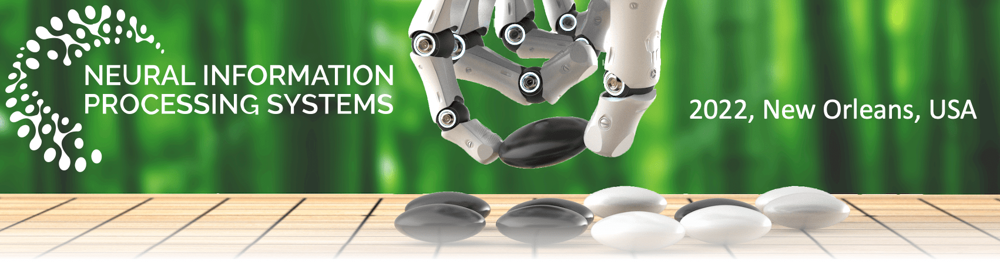
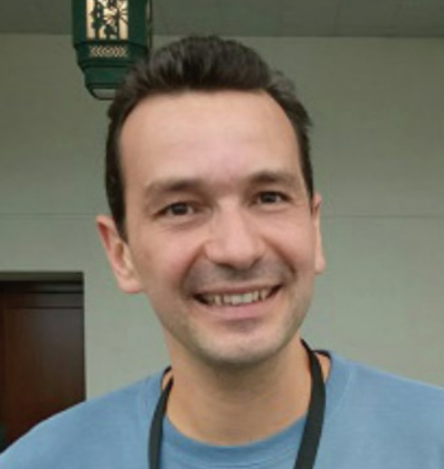
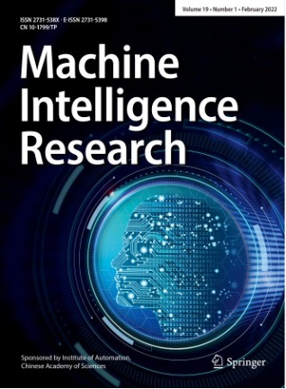

 
 

 <b> NeurIPS 2022 Workshop on Human in the Loop Learning </b> 

    **Due to cov-19, many authors cannot attend the workshop in person. After discussing with other organisers, the workshop will be organised in a hybrid mode. An official announcement and a poster upload link will come later.**

Recent years have witnessed the rising need for machine learning systems that can interact with humans in the learning loop. Such systems can be applied to computer vision, natural language processing, robotics, and human-computer interaction. Creating and running such systems call for interdisciplinary research of artificial intelligence, machine learning, and software engineering design, which we abstract as Human in the Loop Learning (HiLL). 

The HiLL workshop aims to bring together researchers and practitioners working on the broad areas of HiLL, ranging from interactive/active learning algorithms for real-world decision-making systems (e.g., autonomous driving vehicles, robotic systems, etc.), human-inspired learning that mitigates the gap between human intelligence and machine intelligence, human-machine collaborative learning that creates a more powerful learning system, lifelong learning that transfers knowledge to learn new tasks over a lifetime, as well as interactive system designs  (e.g., data visualization, annotation systems, etc.). 

The HiLL workshop continues the previous effort to provide a platform for researchers from interdisciplinary areas to share their recent research. In this year’s workshop, a special feature is to encourage the discussion on the interactive and collaborative learning between human and machine learning agents: Can they be organically combined to create a more powerful learning system? We believe the theme of the workshop will be of interest to broad NeurIPS attendees, especially those who are interested in interdisciplinary study. 

# Call for Papers
We welcome high-quality submissions on algorithms and system designs in the broad area of human in the loop learning. The topics of HiLL include but are not limited to:

-	Human-machine collaborative learning,
-	Human-inspired learning,
-	Interactive robot learning,
-	Interactive machine learning algorithms for autonomous decision-making systems,
-	Lifelong learning systems,
-	Online learning and active learning,
-	Psychology driven human concept learning,
-	Design, testing, and assessment of interactive systems for data analytics.

These topics span a variety of scientific disciplines and application domains like machine learning, human-computer interaction, cognitive science, and robotics. It is an opportunity for scientists in these disciplines to share their perspectives, discuss solutions to common problems and highlight the challenges in the field to help guide future research. The target audience for the workshop includes people who are interested in using machines to solve problems by having a human be an integral part of the learning process. 

We invite submissions of full papers, as well as works-in-progress, position papers, and papers describing open problems and challenges. While original contributions are preferred, we also invite submissions of high-quality work that has recently been published in other venues or is concurrently submitted. We encourage creative ML approaches, as well as interdisciplinarity and perspectives from outside traditional ML. **Papers should be 4-8 pages in length (excluding references, checklist and appendix) formatted using the [NeurIPS template](https://neurips.cc/Conferences/2022/PaperInformation/StyleFiles)**. All the submissions should be anonymous. The accepted papers are allowed to get submitted to other conference venues. 

Papers can be submitted through CMT:
​
[ https://cmt3.research.microsoft.com/NeurIPSHILL2022]( https://cmt3.research.microsoft.com/NeurIPSHILL2022)

Contact chairs: [hill_neurips22@googlegroups.com](hill_neurips22@googlegroups.com)

# Important Dates

- Submission deadline: 24:00 Pacific Time (PT), <del> Sep 29 </del> **Oct 7**, 2022
- Acceptance notification: 24:00 Pacific Time (PT), <del>Oct 14</del> **Oct 27**, 2022
- camera-ready deadline: 24:00 Pacific Time (PT), Nov 3, 2022
- **Workshop date: 8:30~17:00, Dec 2, 2022, New Orleans time [click to join](https://neurips.cc/virtual/2022/workshop/49957)**

- We will select **best paper** this year.

- High-quality papers of NeurIPS 2022 Workshop on Human in the Loop Learning will be recommended to publish with **Machine Intelligence Research** (EI and ESCI indexed journal).

# Speakers of HILL Workshop @ NeurIPS 2022
We invite representative researchers from the related areas to give featured talks. We are honored to have the following speakers:

<table>
<tr>
<td>
 Alison Gopnik, Professor at   University of California, Berkeley
</td>
<td>
 Peter Stone, Professor at   University of Texas at Austin 
</td>
<td>
 Sarit Kraus, Professor at   Bar-Ilan University
</td>
</tr>

<tr>
<td>
 Samuel Kaski, Professor at   University of Manchester and Aalto University
</td>
<td>
 Lydia Kavraki, Professor at   Rice University
</td>
<td>
 Danica Kragic, Professor at   Royal Institute of Technology, KTH 
</td>
</tr>

<tr>
<td>
 Cynthia Rudin, Professor at   Duke University
</td>
<td>
 Jens Kober, Associate Professor at   Delft University of Technology </td>
<td>
 Dorsa Sadigh, Assistant Professor at   Stanford University
</td>
</tr>

<tr>
<td>
 Brenna Argall, Associate Professor at   Northwestern University
</td>
<td>
 Igor Mordatch at   Google Brain
</td>
<td>
 Dan Bohus, Senior Principal Researcher at   Microsoft Research
</td> 
</tr>

<tr>
<td>
 Ding Zhao, Assistant Professor at   CMU
</td>

</tr>

</table> 
 

# Agenda of HILL Workshop @ NeurIPS 2022 (TBD)

Dec 2, 2022, New Orleans, USA

**Will be changed later ...**

<!--
 Coming Soon :) -->

| Time (US/Pacific)         | Speaker     |   Topic (TBD)
|--------------|-----------|-----------|
| 8:00am-8:30am | Jens Kober  | Interactive Imitation Learning in Robotics |
| 8:30am-9:00am | Peter Stone    | Human in the Loop Learning for Robot Navigation and Task Learning from Implicit Human Feedback |
| 9:00am-9:30am | Sarit Kraus    |  	|
| 9:30am-10:00am | Samuel Kaski   |  	|
| 10:00am-10:30am | Lydia Kavraki  |  	|
| 10:30am-11:00am | Danica Kragic  |  	|
| 11:00am-11:30am | Cynthia Rudin  |		|
| 11:30am--14:00am |   |	Break	|
| 14:00am-14:30am | Brenna Argall  |		|
| 14:30am-15:00am | Igor Mordatch  |		|
| 15:00am-15:30am | Dan Bohus      |		|
| 15:30am-16:00am | Alison Gopnik  | Imitation, Innovation and Caregiving in Children and AI	|
| 16:00am-16:30am | Dorsa Sadigh   |		|
| 16:30am-17:00am | Ding Zhao      |	Evaluation of  Long-Tailed High-Stakes Human-Machine Interaction	|

# Co-chairs

<!--
- Vittorio Ferrari, Senior Staff Research Scientist at Google, Honorary Professor at the Uni. of Edinburgh
- Shanghang Zhang, Assistant Prof. at Peking Uni.
- Wei Pan, Associate Prof. at Manchester and TU Delft
- Pradeep Ravikumar, Prof. at CMU
- Fisher Yu, Assistant professor at ETH Zurich
- Hao Dong, Assistant Prof. at Peking Uni.
- Xin Wang, Senior Researcher at Microsoft Research
- -->	
 
<table> 

<tr>
<td>
 Shanghang Zhang, Assistant Professor at   Peking University
</td>
<td>
 Hao Dong, Assistant Professor at   Peking University
</td>
<td>
 Fisher Yu, Assistant Professor    at ETH Zurich </td> 
<td>
 Pradeep Ravikumar,     Professor at CMU
</td>

</tr>
<tr>
<td>
 Xin Wang, Senior Researcher   at Microsoft Research
</td>
<td>
 Wei Pan, Assistant Professor   at University of Manchester
</td>
<td>
 Vittorio Ferrari   Principal Scientist at Google   Honorary Professor at  University of Edinburgh
 </td>
</tr>

</table> 

# Co-sponsor: Machine Intelligence Research

Machine Intelligence Research (original title: International Journal of Automation and Computing), published by Springer, and sponsored by Institute of Automation, Chinese Academy of Sciences, is formally released in 2022. The journal publishes high-quality papers on original theoretical and experimental research, targets special issues on emerging topics and specific subjects, and strives to bridge the gap between theoretical research and practical applications. The journal has been indexed by ESCI, EI, Scopus, CSCD, etc. 

- MIR official websites
	- https://www.springer.com/journal/11633
	- https://www.mi-research.net

- MIR Editor-in-Chief
 	- Tan Tieniu, Institute of Automation, Chinese Academy of Sciences

- MIR Associate Editors-in-Chief
	- Liang Wang, Chinese Academy of Sciences, China
	- Yike Guo, Imperial College London, UK
	- Brian C. Lovell, The University of Queensland, Australia
 
  

 
<!--   -->

  